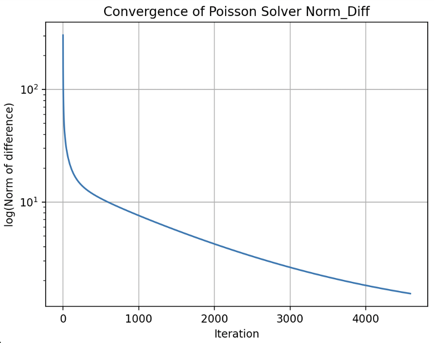

# Poisson solver 
In incompressible flows, ensuring mass conservation requires solving the Poisson equation for pressure at each time step, based on the updated velocity field. This step is crucial for projecting the velocity field to satisfy the continuity equation:
where $\nabla^2 p = \nabla \cdot \mathbf{u}^*$
where p is the intermediate velocity field computed from the momentum equation.
To solve this equation efficiently, two common iterative solvers are used: Jacobi and Gauss-Seidel methods. In this section, I will explain both methods step by step, provide scripts for their implementation, and compare their performance.

## Jacobi 
The Jacobi method computes the solution iteratively by solving for each variable in terms of the others using values from the previous iteration.
### Algorithm steps 
1. **Initialize variables.** Start with the current p field & define the RHS (b) of the Poisson equation (derived from velocity divergence). 
2. **Precompute coefficients.** Precompute p_coef and b, which are adjusted for the grid spacings. $p_{\text{coef}} = \frac{1}{2(\Delta x^2 + \Delta y^2)}$$ $$b_{i,j} \leftarrow b_{i,j} \cdot \frac{2(\Delta x^2 + \Delta y^2) \rho}{\Delta x^2 \Delta y^2}$ The computation of b depends on the method used (projection or predictor-corrector). 
4. **Iteration.** Jacobian update of p on the interior grid points.  $p_{i,j}^{(k+1)} = p_{\text{coef}} \left[ (p_{i+1,j}^{(k)} + p_{i-1,j}^{(k)}) \Delta y^2 + (p_{i,j+1}^{(k)} + p_{i,j-1}^{(k)}) \Delta x^2 \right] - b_{i,j}$
5. **Enforce Boundary Conditions** Apply Neumann boundary conditions $\frac{\partial p}{\partial n} = 0$ in this case. This may change depending on the BC problem.
6. **Compute Error** Calculate the root-mean-square (RMS) error between successive pressure fields: $\text{Error} = \sqrt{\frac{1}{N} \sum_{i,j} \left( p_{i,j}^{(k+1)} - p_{i,j}^{(k)} \right)^2}$
7. **End of the iteration** Iteration automatically ends if: 
    A) Error is lower than tolerance.
    B) Maximum number of iterations is reached.
8. **Output** Return the final pressure field, which satisfies the Poisson equation within the specified tolerance.


```python
def pressure_poisson(p, b, dx, dy, tol, maxiter):
    """
    Solve the Poisson equation for pressure correction using Jacobi's iterative method.

    Parameters:
    -----------
    p : numpy.ndarray
        Current pressure field. This array will be updated iteratively.
    b : numpy.ndarray
        Right-hand side of the Poisson equation, derived from velocity divergence.
    dx, dy : float
        Grid spacing in the x and y directions.
    tol : float
        Convergence tolerance for the root-mean-square error.
    maxiter : int
        Maximum number of iterations. Accelerates the speed at the beginning of the iterations. 
    rho : density. 

    Returns:
    --------
    numpy.ndarray
        The updated pressure field that satisfies the Poisson eq. within the specified tolerance.

    Notes:
    ------
    - Implements Jacobi's method, iteratively updating the pressure field.
    - Enforces Neumann boundary conditions (zero pressure gradient) on all domain edges (this is just for the Cavity Flow case). 
    - The method stops when either the error falls below the specified tolerance or the maximum
      number of iterations is reached.
    """
    err = np.inf # Initialize huge error.
    nit = 0 # Reset num iterations.
    pcoef = 0.5 / (dx**2 + dy**2) # Simplifies code
    b *= rho * dx**2 * dy**2 / (2*(dx**2 + dy**2))

    while err > tol and nit < maxiter:
        pn = p.copy()

        p[1:-1, 1:-1] = (pcoef * ((pn[1:-1, 2:] + pn[1:-1, :-2])*dy**2
                        + (pn[2:, 1:-1] + pn[:-2, 1:-1])*dx**2) - b)

        # BCs. Openfield.
        p[:, 0] = p[:, 1] # dp/dx=0 at x=0.
        p[:, -1] = -p[:, -2] # p = 0 at x = L.
        p[0, :] = p[1, :]   # dp/dy = 0 at y = 0.
        p[-1, :] = p[-2, :] # dp/dx = 0 at y = 2.

        err = np.mean((p[1:-1, 1:-1] - pn[1:-1, 1:-1])**2)**0.5
        nit += 1

    return p
```

## Gauss-Seidel
The Gauss-Seidel method improves on Jacobi's iterative solver by updating the pressure values in-place, making it more computationally efficient. What is more, it has been implemented using Cython for an even faster convergence.
### Algorithm steps 
1. **Initialize variables.** Start with the current p field & define the RHS (b) of the Poisson equation (derived from velocity divergence). 
2. **Precompute coefficients.** Precompute p_coef and b, which are adjusted for the grid spacings.$p_{\text{coef}} = \frac{1}{2(\Delta x^2 + \Delta y^2)}$ $b_{i,j} \leftarrow b_{i,j} \cdot \frac{2(\Delta x^2 + \Delta y^2) \rho}{\Delta x^2 \Delta y^2}$ 
4. **Iteration.** Loop through the grid, updating the pressure values in-place at each grid point using the formula: $p_{i,j} = p_{\text{coef}} \left[ (p_{i,j+1} + p_{i,j-1}) \Delta y^2 + (p_{i+1,j} + p_{i-1,j}) \Delta x^2 \right] - b_{i,j}$
5. **Enforce Boundary Conditions** Apply Neumann boundary conditions $\frac{\partial p}{\partial n} = 0$ in this case. This may change depending on the BC problem.
6. **Compute Error** Calculate the root-mean-square (RMS) error between successive pressure fields: $\text{Error} = \sqrt{\frac{1}{N} \sum_{i,j} \left( p_{i,j}^{(k+1)} - p_{i,j}^{(k)} \right)^2}$
7. **End of the iteration** Iteration automatically ends if: 
    A) Error is lower than tolerance.
    B) Maximum number of iterations is reached.
8. **Output** Return the final pressure field, which satisfies the Poisson equation within the specified tolerance.

<p style="text-align: center;">
    
    <br>
    <span style="display: block; text-align: center;">Chorin's algorithm schematic.</span>
</p>


```python
def pressure_poisson_gauss_seidel(p, b, dx, dy, rho):
    """
    Solve the Poisson equation for pressure correction using the Gauss-Seidel method.

    This function iteratively solves the pressure Poisson equation, which is derived from 
    the incompressible Navier-Stokes equations to ensure mass conservation. It uses the 
    Gauss-Seidel method for in-place updates, leveraging the latest pressure estimates 
    during each iteration for faster convergence.

    Parameters:
    -----------
    p : numpy.ndarray
        The pressure field (2D array) that needs to be updated in order to satisfy the Poisson equation. 
    b : numpy.ndarray
        The Poisson's equation RHS (b term, 2D array) derived from the velocity divergence.
    dx : float
        Grid spacing in the x-direction.
    dy : float
        Grid spacing in the y-direction.
    rho : float
        Fluid density, used to scale the source term.

    Returns:
    --------
    p : numpy.ndarray
        Updated pressure field satisfying the Poisson equation within the specified tolerance.

    Key Features:
    --------------
    1. In-place updates using Gauss-Seidel accelerate convergence compared to Jacobi's method.
    2. Enforces Neumann boundary conditions (zero pressure gradient) on all domain edges (this is just for the Cavity Flow case).
    3. Convergence is determined based on the root-mean-square (RMS) error between iterations.
    """
    err = np.inf  # Initialize a large error.
    nit = 0  # Reset the number of iterations.
    pcoef = 0.5 / (dx**2 + dy**2)  # Precompute coefficient for simplicity.
    b *= rho * dx**2 * dy**2 / (2 * (dx**2 + dy**2))

    while err > tol and nit < maxiter:
        pn = p.copy()

        # Gauss-Seidel in-place update
        p = gauss_seidel_iteration(p, b, pcoef, dx, dy)

        # Apply boundary conditions
        p[:, 0] = p[:, 1] # dp/dx=0 at x=0.
        p[:, -1] = -p[:, -2] # p = 0 at x = L.
        p[0, :] = p[1, :]   # dp/dy = 0 at y = 0.
        p[-1, :] = p[-2, :] # dp/dx = 0 at y = 2.

        # Calculate error based on the new values
        err = np.mean((p[1:-1, 1:-1] - pn[1:-1, 1:-1])**2)**0.5
        nit += 1

    return p
```

## Comparison of Poisson Solvers: Jacobi vs. Gauss-Seidel

To assess the performance of the Jacobi and Gauss-Seidel methods in solving the Poisson equation, both algorithms were applied to the same flow setup. The figure below shows the resulting divergence fields for each method: the Jacobi solution is shown on the left, and the Gauss-Seidel solution on the right.

<p style="text-align: center;">
    
    <br>
    <span style="display: block; text-align: center;">Divergence field results using Jacobi (left) and Gauss-Seidel (right) solvers.</span>
</p>


For the same problem setup, the Gauss-Seidel method converged approximately 45% faster, requiring only 17 seconds compared to 32 seconds for the Jacobi solver. Furthermore, the final velocity field obtained with Gauss-Seidel had a divergence four orders of magnitude smaller than that obtained using Jacobi. This highlights Gauss-Seidel's improved numerical stability and effectiveness in enforcing the incompressibility constraint, making it a more efficient and accurate choice for solving the Poisson equation in this context.

What’s more, the Gauss-Seidel solver can be further optimized using Cython, allowing for substantial reductions in computation time by accelerating the most performance-critical loops in the algorithm.


### Performance Optimization with Cython make this more casual. 
To improve the performance of the iterative solver, Cython is used. Cython is a superset of Python that enables C-like performance optimizations while preserving the readability and ease of Python syntax. By compiling Python code to C, it allows the iterative solver to execute much faster, which is essential for large grid sizes in computational fluid dynamics simulations.

In particular, the `gauss_seidel_iteration` function is implemented using Cython, which allow direct and efficient interaction with NumPy arrays while avoiding the overhead of Python's dynamic typing. This approach enables fast and memory-efficient manipulation of large datasets, making it well-suited for CFD applications. Instructions for usage are included in the documentation of the function.


```python
def gauss_seidel_iteration(cnp.ndarray[cnp.double_t, ndim=2] p,
                           cnp.ndarray[cnp.double_t, ndim=2] b,
                           double pcoef,
                           double dy,
                           double dx):
    cdef int i,j

    for i in range(1,p.shape[0]-1):
        for j in range(1,p.shape[1]-1):
            p[i,j] = pcoef * ((p[i,j+1] + p[i,j-1]) * dy**2
                                + (p[i+1,j] + p[i-1,j]) * dx**2) - b[i-1,j-1]

    return p

# Instructions for usage:
# 1. Recompile the pyx file: python setup.py build_ext --inplace
# 2. Run main.py normally 
```

### Convergence of the Poisson Solver

The convergence behavior of the Gauss-Seidel solver is illustrated in the following figure, which plots the logarithm of the norm of the residual (the difference between successive pressure fields) as a function of the number of iterations. This metric provides a quantitative measure of how rapidly the solution approaches a steady state. The curve exhibits a steep decline during the first 700 iterations, indicating rapid error reduction in the early stages of the solution process. Beyond this point, the slope of the curve decreases, forming a slightly concave shape that reflects slower but continued convergence toward the final solution. This behavior highlights the diminishing returns of additional iterations once the residual has been sufficiently minimized. Therefore, it is important to define an appropriate convergence threshold to find a practical balance between computational efficiency and solution accuracy.



<p style="text-align: center; font-size: 0.9em; color: #666;">
Convergence of the Poisson solver: logarithm of the residual norm versus number of iterations.
</p>

