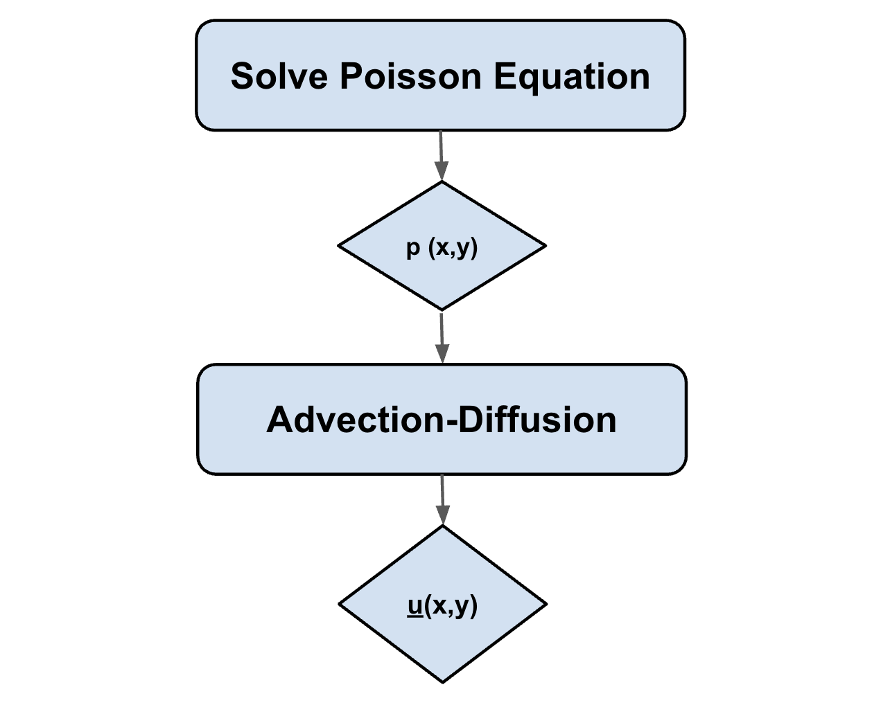
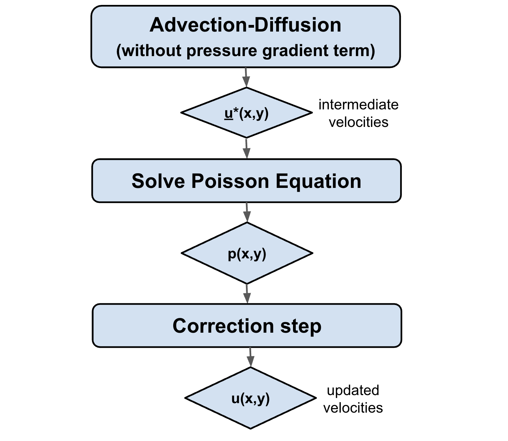

# Algorithm
In this section, we outline and compare two different numerical algorithms employed to solve the incompressible Navier-Stokes equations: the unsplit 1st-order **Euler's Method** and the **Fractional-Step Method**. These algorithms differ in their sequence of operations and the way they integrate the pressure and velocity fields over time. I will explain and implement both methods and compare their performance and results in terms of accuracy and computational efficiency.

## 1st order unsplit Euler's method
The primary goal of this method is to ensure that the computed velocity field remains divergence-free (mass conserves) at each timestep. This is achieved through two main steps: **pressure projection** and **advection-diffusion**, which are alternated to ensure the incompressibility condition.

Algorithm 1 flowchart: First-Order Unsplit Euler Method

### Step 1. Solving a Poisson equation for pressure. 
The first step is to **solve the Poisson equation** for the pressure, which is derived from the incompressibility condition $\nabla^2 p = \nabla \cdot \mathbf{u}^*$. The ultimate goal is to **calculate the pressure gradient** that will ensure zero divergence when performing the advection-diffusion step. 

### Step 2. Advection-Diffusion with Pressure Gradient

The advection-diffusion step updates the velocity field by incorporating the pressure gradient ($\nabla p^*$) obtained from the solution of the Poisson solver. This step ensures the incompressibility of the flow by **adjusting the velocity field based on the pressure distribution**, while simultaneously advecting and diffusing the fluid.

The advection-diffusion equation, which includes the pressure gradient, is:

\[
\mathbf{u}^{n+1} = \mathbf{u}^n + \Delta t \left[ -\frac{1}{\rho} \nabla p^* + \nu \nabla^2 \mathbf{u}^n - (\mathbf{u}^n \cdot \nabla) \mathbf{u}^n + \mathbf{f} \right] \tag{1} \label{eq:advdiff}
\]

## Fractional-Step Method

Chorin's **fractional step algorithm** is a widely used method to solve the incompressible Navier-Stokes equations. The key idea is to first update the velocity field without accounting for the pressure gradient. This yields an **intermediate velocity field** that may not satisfy the incompressibility constraint, i.e., it may have non-zero divergence.

To enforce incompressibility, a **pressure correction** is introduced. The final velocity field $\mathbf{u}^{n+1}$ is obtained by subtracting the gradient of the pressure field from the intermediate velocity $\mathbf{u}^*$. This projection step is written as:

\[
\mathbf{u}^{n+1} = \mathbf{u}^* - \Delta t \nabla p^{n+1} \tag{2}
\]

As shown in equation [(2)](#eq-projection), the pressure field acts as a correction to ensure the final velocity field satisfies the incompressibility condition.

Algorithm 2 flowchart: Fractional Step Method.

---

### Step 1. Advection-Diffusion Step

In the prediction step, the velocity field is updated by solving the **advection-diffusion equation without the pressure gradient term**. This means that the velocity evolves based on fluid advection and diffusion effects, but **incompressibility is not enforced** at this stage. The governing equation is:

\[
\mathbf{u}^{*} = \mathbf{u}^n + \Delta t \left[\nu \nabla^2 \mathbf{u}^n - (\mathbf{u}^n \cdot \nabla) \mathbf{u}^n + \mathbf{f} \right] \tag{3}
\]

The result of this step is an **intermediate velocity** field $\mathbf{u}^*$ that may not satisfy the incompressibility condition, i.e., $\nabla \cdot \mathbf{u}^* \ne 0$.

---

### Step 2. Solve the Poisson Equation

To enforce incompressibility, we solve a **Poisson equation** for pressure, derived by applying the divergence operator to the velocity update in equation [(3)](#eq-advdiff). The result is:

\[
\nabla^2 p = \frac{\rho}{\Delta t} \nabla \cdot \mathbf{u}^{*} \tag{4}
\]

Solving equation [(4)](#eq-poisson) yields the **pressure distribution** needed to correct the intermediate velocity field and enforce the divergence-free constraint.

---

### Step 3. Correction Step

After obtaining the pressure field, the velocity is corrected using a pressure-gradient subtraction. This projection is equivalent to equation [(2)](#eq-projection), but explicitly shows the scaling factor:

\[
\mathbf{u}^{n+1} = \mathbf{u}^* - \frac{\Delta t}{\rho} \nabla p \tag{5}
\]

As shown in equation [(5)](#eq-correct), this correction step ensures that the resulting velocity field $\mathbf{u}^{n+1}$ is divergence-free, completing the fractional-step update.

<!-- 

Chorin's algorithm workflow. REDO THIS FIGURE WITH WHITE BACKGROUND.

 -->

