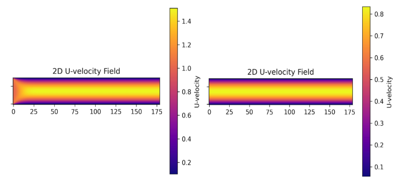

# Boundary Conditions

**Boundary conditions (BCs)** are a fundamental component of any numerical simulation, as they define how the system interacts with its surroundings. In the context of incompressible Navier-Stokes solvers, they play a critical role in ensuring **accurate and stable** solutions. This chapter introduces the main types of boundary conditions used in CFD and describes how they are applied in each of the configurations considered in this notebook.

---

## 1. Types of Boundary Conditions

- **Dirichlet Boundary Condition**  
  Specifies the value of a variable at the boundary. For example, setting a fixed inflow velocity or a zero pressure at a jet. When it comes to walls, there are two commonly used boundary conditions: 
    - **No-Slip Condition**  
  A type of Dirichlet BC where velocity is set to zero at solid walls.
    - **Slip Condition**  
  Allows tangential velocity but prevents normal velocity at walls, often used in inviscid or simplified flow models.

- **Neumann Boundary Condition**  
  Specifies the derivative (usually normal to the boundary) of a variable. Commonly used to model outflow conditions or natural walls where flux is zero.

- **Periodic Boundary Condition**  
  Used when the domain wraps around, like in fully developed flows or repeated geometries. Variables exiting one side re-enter on the opposite side.

---

Setting **appropiate boundary conditions** is one of the most critical steps in solving the incompressible Navier-Stokes equations. The choice of boundary conditions directly influences the stability, accuracy, and physical realism of the simulation. For example, the **no-slip condition** on solid walls is commonly used, while **zero-gradient conditions** are often applied at outflows or boundaries where the flow should not be constrained. Different flow scenarios may require very different boundary treatment—for instance, prescribing a fixed pressure at the outlet versus allowing the flow to develop naturally from a pressure gradient. Even **small changes to boundary conditions can lead to drastically different solutions** or, in some cases, cause the simulation to diverge or crash entirely.

The following figure illustrates how slightly different boundary condition configurations can lead to substantially different solutions, even in a simple channel flow setup:

Comparison of horizontal velocity fields for two different boundary condition setups in a channel flow.

On the left, a **uniform velocity profile** is imposed at the inlet and the **pressure is fixed at the outlet**. This results in a developing flow region near the inlet, where the velocity gradually adjusts toward a parabolic profile.

On the right, the **pressure is fixed at both the inlet and the outlet**, and the velocity is not explicitly prescribed. Instead, the flow develops naturally in response to the **imposed pressure difference** across the domain. In this case, the parabolic velocity profile is already fully developed from the entrance, and **no entrance region is observed**.

This comparison highlights how **boundary conditions** not only influence numerical stability but also fundamentally **shape the physical behavior of the simulated flow**.

 Several practical configurations and their resulting solutions are explored in detail in the [Solutions](#solutions) chapter, where we examine how specific combinations of boundary conditions affect the flow behavior.
 