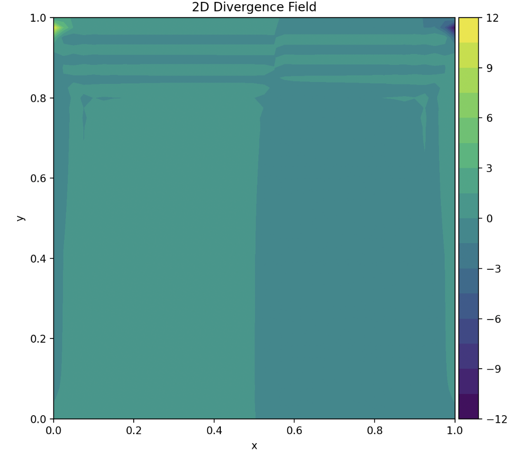
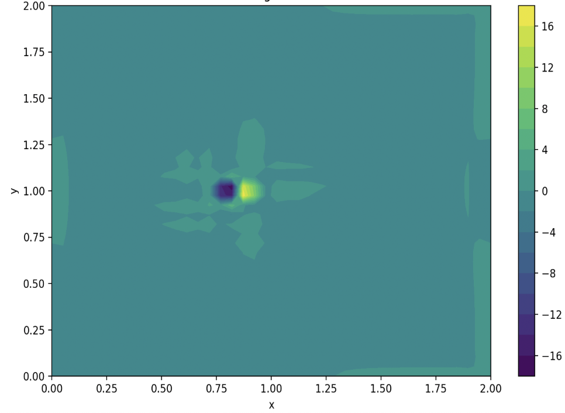
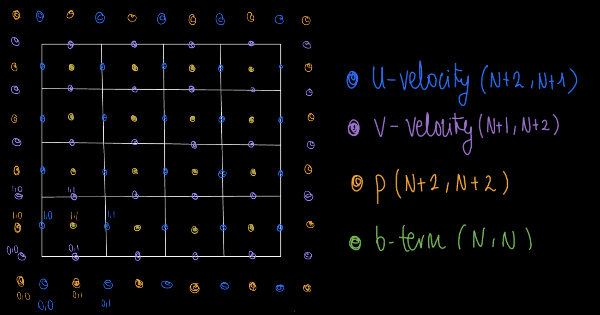

# Grid Types 
Numerical solvers for the incompressible Navier-Stokes equations often use structured grids to discretize the computational domain. Two common types of grids are **collocated grids** and **staggered grids**. This section explains these grid configurations, discusses why staggered grids are often preferred for maintaining incompressibility and compares the results of using the different grids for the same cases. 

Grid Types: Collocated and staggered

## Collocated Grid

In a **collocated grid** all flow variables—such as the velocity components $(u, v)$ and pressure $p$—are stored at the same grid points (typically at cell centers). This arrangement simplifies data storage and implementation, especially in structured solvers. However, this can lead to spurious pressure oscillations, often referred to as *checkerboard patterns*, which can make the numerical solution unstable or non-physical.

(Undesired) Checkerboard effect 

In addition to pressure-velocity decoupling, another potential issue with collocated grids is the failure to fully enforce the mass conservation condition. This can result in non-zero divergence across the domain, particularly in regions with complex flow features or sharp gradients. The following divergence maps highlight this effect in three different scenarios. In the lid-driven cavity case (left), divergence appears primarily at the corners, likely due to abrupt changes in boundary conditions. In the channel flow with a square obstacle (center), and open flow around a wind turbine (right).</em>

In addition to pressure-velocity decoupling, another potential issue with collocated grids is the failure to fully enforce the mass conservation condition. This can result in non-zero divergence across the domain, particularly in regions with complex flow features or sharp gradients. The following divergence maps highlight this effect in three different scenarios. In the lid-driven cavity case (left), divergence appears primarily at the corners, most probably due to aggresive changes in boundary conditions. In the channel flow with a square obstacle (center), divergence is concentrated at the inlet corners and around the object, where strong velocity gradients and flow separation make it difficult to maintain a divergence-free field. In the open flow around a wind turbine (right), divergence is observed both in front of and behind the turbine, likely caused by large, concentrated velocity gradients. 

Divergence field for cavity flow.

Divergence field for channel flow around a square obstacle.

Divergence field for a turbine (axial induction) in an open flow. 

To mitigate this issues, correction schemes can be employed to **stabilize** the pressure field. However, adopting a **staggered grid** potentially offers a more fundamental solution by addressing the root cause of the decoupling.

## Staggered Grid

In a **staggered grid**, different variables are stored at different spatial locations within each grid cell, in this case:

- **Pressure** $p$ is stored at the **cell center**.
- The **horizontal velocity** component $u$ is stored at the center of the **vertical cell faces**.
- The **vertical velocity** component $v$ is stored at the center of the **horizontal cell faces**.

Staggered grid. Variables location layout.

This configuration **naturally couples pressure and velocity** by positioning them at offset locations (velocity components are on the cell faces and pressure at the cell centers). This offset arrangement may help satisfy the discretized continuity equation more accurately. It could also reduce or eliminate pressure oscillations without the need for artificial interpolation, potentially making staggered grids more effective for incompressible flow solvers.

## Comparison of Solutions

To evaluate the practical impact of grid configuration, I implemented both a collocated and a staggered grid version of the solver and ran them on the same test case.

INSERT FIGURES OF VELOCITY AND DIVERGENCE FOR COLLOCATED AND STAGGERED. 
FIND SIMILAR CASES AND COMPARE. HOW DIFFERENT WERE THEY? CAN I FIND CHECKERBOARD AND NO CHECKERBOARD? 

EXPLAIN

> *Insert plots showing velocity fields and divergence magnitude for both grid types.*

This comparison illustrates the **numerical robustness and stability** of staggered grids for solving the incompressible Navier-Stokes equations.

