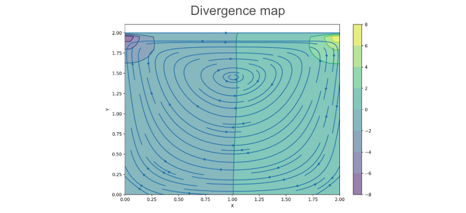

# Grid Types 
Numerical solvers for the incompressible Navier-Stokes equations often use structured grids to discretize the computational domain. Two common types of grids are **collocated grids** and **staggered grids**. This section explains these grid configurations, discusses why staggered grids are often preferred for maintaining incompressibility and compares the results of using the different grids for the same cases. 

Grid Types: Collocated and staggered. Need to include Copyright. 

## Collocated Grid

In a **collocated grid**, all primary flow variables, such as the velocity components $(u, v)$ and pressure $p$, are stored at the same spatial locations, typically at the cell centers. This setup simplifies memory management and implementation, especially for structured solvers. However, this arrangement can make it more difficult to **numerically couple pressure and velocity**, which are already decoupled in the continuous incompressible Navier-Stokes equations. If not treated carefully, this may lead to *spurious oscillations*, often appearing as a **checkerboard pattern** in the solution.

An example of the (undesired) checkerboard effect on a collocated grid.

Another challenge is the enforcement of mass conservation. In collocated grids, this can result in **non-zero divergence** across the domain, particularly in regions with steep velocity gradients or complex boundary interactions. The following divergence maps illustrate this effect across three different scenarios:

- **Lid-driven cavity:** Divergence appears mostly in the corners, likely due to sharp velocity changes imposed by the boundary conditions.

Divergence  map for the lid-driven cavity flow problem.

- **Channel flow:** Divergence is concentrated at the inlet corners. This is likely caused by the sudden onset of flow and the interaction between imposed boundary conditions and the pressure field, which can be challenging to resolve with a collocated grid.

Divergence map for the channel flow problem.

- **Flow around a square obstacle:** Divergence appears near the object, where strong recirculation and flow separation make it difficult to maintain mass conservation.

Velocity and divergence map for channel flow around a square obstacle.

- **Flow accross a wind turbine:** Divergence accumulates on the front and back of the wind turbine. This is caused by the strong velocity gradients generated by the axial induction force. 

Velocity and divergence map for a flow accross a turbine.

To mitigate this issues, correction schemes can be employed to **stabilize** the pressure field. However, adopting a **staggered grid** potentially offers a more fundamental solution by addressing the root cause of the decoupling.

## Staggered Grid

In **staggered grids**, different variables are stored at different spatial locations within each grid cell, in this case:

- **Pressure** $p$ is stored at the **cell center**.
- The **horizontal velocity** component $u$ is stored at the center of the **vertical cell faces**.
- The **vertical velocity** component $v$ is stored at the center of the **horizontal cell faces**.

Staggered grid. Variables location layout.

This configuration **naturally couples pressure and velocity** by storing them at offset locations—velocity components on the cell faces and pressure at the cell centers. This staggered layout helps enforce the discretized continuity equation more accurately, potentially getting rid of the divergence and oscillations. As a result, staggered grids are often more effective for incompressible flow solvers where maintaining a divergence-free velocity field is essential.

The following figure shows the results for a **flow across a wind turbine** using a staggered grid. It displays the divergence, pressure, and velocity fields. Notice how the divergence has been effectively eliminated around the turbine and only minimal residual values remain left near the outlet region.

Divergence, pressure and velocity fields of a flow accross a wind turbine, using a staggered grid. 

