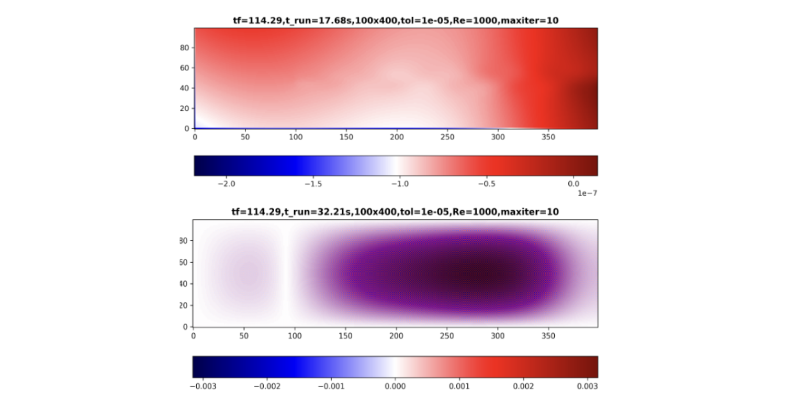
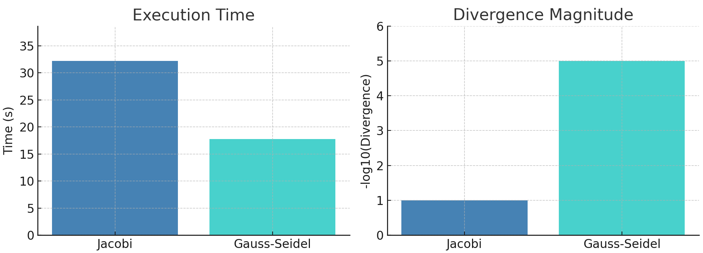

# Poisson Solver

In incompressible flows, ensuring mass conservation requires solving the **Poisson equation for pressure** at each time step, based on the updated velocity field. This step is crucial for projecting the velocity field so that it satisfies the continuity equation.

<div id="eq-poisson-pressure"></div>

\[
\nabla^2 p = \nabla \cdot \mathbf{u}^* \tag{1}
\]

Here, $\mathbf{u}^*$ is the intermediate (non-divergence-free) velocity field computed from the momentum equation, and $p$ is the pressure field used to correct it.

To solve [**(1)**](#eq-poisson-pressure) efficiently, two common iterative methods are widely used:

- **Jacobi Method**
- **Gauss-Seidel Method**

In this section, we will explain both methods step by step, provide Python implementations, and compare their performance.

---

## Jacobi Method

The **Jacobi method** computes the solution to the Poisson equation iteratively by solving for each variable in terms of the others using values from the **previous iteration**.

### Algorithm Steps

1. **Initialize variables**  
   Start with the current pressure field \( p \), and define the **right-hand side** of the Poisson equation, derived from the divergence of the intermediate velocity field.

2. **Precompute coefficients**  
   Precompute the coefficient for the pressure update and the scaled right-hand side:

<div id="eq-pcoef"></div>

\[
p_{\text{coef}} = \frac{1}{2(\Delta x^2 + \Delta y^2)} \tag{2}
\]

<div id="eq-bscaled"></div>

\[
b_{i,j} \leftarrow b_{i,j} \cdot \frac{2(\Delta x^2 + \Delta y^2) \rho}{\Delta x^2 \Delta y^2} \tag{3}
\]

> Note: The exact form of \( b \) depends on the method used (e.g., projection vs. predictor-corrector).

3. **Jacobi iteration**  
   Update pressure on the **interior grid points** using:

<div id="eq-jacobi-update"></div>

\[
p_{i,j}^{(k+1)} = p_{\text{coef}} \left[ (p_{i+1,j}^{(k)} + p_{i-1,j}^{(k)}) \Delta y^2 + (p_{i,j+1}^{(k)} + p_{i,j-1}^{(k)}) \Delta x^2 \right] - b_{i,j} \tag{4}
\]

4. **Enforce boundary conditions**  
   Apply **Neumann boundary conditions**:  
   \[
   \frac{\partial p}{\partial n} = 0
   \]  
   Other BCs may be required depending on the physical setup.

5. **Compute error**  
   Calculate the **root-mean-square (RMS) error** between successive pressure fields:

<div id="eq-jacobi-error"></div>

\[
\text{Error} = \sqrt{\frac{1}{N} \sum_{i,j} \left( p_{i,j}^{(k+1)} - p_{i,j}^{(k)} \right)^2} \tag{5}
\]

6. **Check for convergence**  
   Stop iterating if **either**:
   - A) The error falls below a specified **tolerance**  
   - B) The **maximum number of iterations** is reached

7. **Output**  
   Return the final pressure field, which approximately satisfies the Poisson equation [**(1)**](#eq-poisson-pressure) within the desired tolerance.

```python
def pressure_poisson(p, b, dx, dy, tol, maxiter):
    """
    Solve the Poisson equation for pressure correction using Jacobi's iterative method.

    Parameters:
    -----------
    p : numpy.ndarray
        Current pressure field. This array will be updated iteratively.
    b : numpy.ndarray
        Right-hand side of the Poisson equation, derived from velocity divergence.
    dx, dy : float
        Grid spacing in the x and y directions.
    tol : float
        Convergence tolerance for the root-mean-square error.
    maxiter : int
        Maximum number of iterations. Accelerates the speed at the beginning of the iterations. 
    rho : density. 

    Returns:
    --------
    numpy.ndarray
        The updated pressure field that satisfies the Poisson eq. within the specified tolerance.

    Notes:
    ------
    - Implements Jacobi's method, iteratively updating the pressure field.
    - Enforces Neumann boundary conditions (zero pressure gradient) on all domain edges (this is just for the Cavity Flow case). 
    - The method stops when either the error falls below the specified tolerance or the maximum
      number of iterations is reached.
    """
    err = np.inf # Initialize huge error.
    nit = 0 # Reset num iterations.
    pcoef = 0.5 / (dx**2 + dy**2) # Simplifies code
    b *= rho * dx**2 * dy**2 / (2*(dx**2 + dy**2))

    while err > tol and nit < maxiter:
        pn = p.copy()

        p[1:-1, 1:-1] = (pcoef * ((pn[1:-1, 2:] + pn[1:-1, :-2])*dy**2
                        + (pn[2:, 1:-1] + pn[:-2, 1:-1])*dx**2) - b)

        # BCs. Openfield.
        p[:, 0] = p[:, 1] # dp/dx=0 at x=0.
        p[:, -1] = -p[:, -2] # p = 0 at x = L.
        p[0, :] = p[1, :]   # dp/dy = 0 at y = 0.
        p[-1, :] = p[-2, :] # dp/dx = 0 at y = 2.

        err = np.mean((p[1:-1, 1:-1] - pn[1:-1, 1:-1])**2)**0.5
        nit += 1

    return p
```
[](https://colab.research.google.com/github/PabloBotin/IndependentStudy/blob/main/mkdocs/site/notebooks/Jacobi.ipynb)

## Gauss-Seidel

The **Gauss-Seidel method** improves on Jacobi's iterative solver by updating the pressure values **in-place**, using the most recent values during each iteration. This results in **faster convergence**. Additionally, this method has been implemented using **Cython** for even greater efficiency.

### Algorithm Steps

1. **Initialize variables**  
   Start with the current pressure field \( p \), and define the **right-hand side** \( b \) of the Poisson equation, derived from the velocity divergence.

2. **Precompute coefficients**  
   As in the Jacobi method, precompute the update coefficient and scale the RHS:

<div id="eq-gs-pcoef"></div>

\[
p_{\text{coef}} = \frac{1}{2(\Delta x^2 + \Delta y^2)} \tag{6}
\]

<div id="eq-gs-bscaled"></div>

\[
b_{i,j} \leftarrow b_{i,j} \cdot \frac{2(\Delta x^2 + \Delta y^2) \rho}{\Delta x^2 \Delta y^2} \tag{7}
\]

3. **Gauss-Seidel iteration**  
   Loop through the grid and update pressure **in-place** using the formula:

<div id="eq-gs-update"></div>

\[
p_{i,j} = p_{\text{coef}} \left[ (p_{i,j+1} + p_{i,j-1}) \Delta y^2 + (p_{i+1,j} + p_{i-1,j}) \Delta x^2 \right] - b_{i,j} \tag{8}
\]

4. **Enforce boundary conditions**  
   Apply **Neumann boundary conditions**:  
   \[
   \frac{\partial p}{\partial n} = 0
   \]  
   Modify as necessary for the physical problem.

5. **Compute error**  
   Calculate the **root-mean-square (RMS) error** between iterations:

<div id="eq-gs-error"></div>

\[
\text{Error} = \sqrt{\frac{1}{N} \sum_{i,j} \left( p_{i,j}^{(k+1)} - p_{i,j}^{(k)} \right)^2} \tag{9}
\]

6. **Check for convergence**  
   Stop iterating if:
   - A) The error is **less than the specified tolerance**, or  
   - B) The **maximum number of iterations** is reached

7. **Output**  
   Return the final pressure field, which approximately satisfies the Poisson equation [**(1)**](#eq-poisson-pressure) within the desired tolerance.

```python
def pressure_poisson_gauss_seidel(p, b, dx, dy, rho):
    """
    Solve the Poisson equation for pressure correction using the Gauss-Seidel method.

    This function iteratively solves the pressure Poisson equation, which is derived from 
    the incompressible Navier-Stokes equations to ensure mass conservation. It uses the 
    Gauss-Seidel method for in-place updates, leveraging the latest pressure estimates 
    during each iteration for faster convergence.

    Parameters:
    -----------
    p : numpy.ndarray
        The pressure field (2D array) that needs to be updated in order to satisfy the Poisson equation. 
    b : numpy.ndarray
        The Poisson's equation RHS (b term, 2D array) derived from the velocity divergence.
    dx : float
        Grid spacing in the x-direction.
    dy : float
        Grid spacing in the y-direction.
    rho : float
        Fluid density, used to scale the source term.

    Returns:
    --------
    p : numpy.ndarray
        Updated pressure field satisfying the Poisson equation within the specified tolerance.

    Key Features:
    --------------
    1. In-place updates using Gauss-Seidel accelerate convergence compared to Jacobi's method.
    2. Enforces Neumann boundary conditions (zero pressure gradient) on all domain edges (this is just for the Cavity Flow case).
    3. Convergence is determined based on the root-mean-square (RMS) error between iterations.
    """
    err = np.inf  # Initialize a large error.
    nit = 0  # Reset the number of iterations.
    pcoef = 0.5 / (dx**2 + dy**2)  # Precompute coefficient for simplicity.
    b *= rho * dx**2 * dy**2 / (2 * (dx**2 + dy**2))

    while err > tol and nit < maxiter:
        pn = p.copy()

        # Gauss-Seidel in-place update
        p = gauss_seidel_iteration(p, b, pcoef, dx, dy)

        # Apply boundary conditions
        p[:, 0] = p[:, 1] # dp/dx=0 at x=0.
        p[:, -1] = -p[:, -2] # p = 0 at x = L.
        p[0, :] = p[1, :]   # dp/dy = 0 at y = 0.
        p[-1, :] = p[-2, :] # dp/dx = 0 at y = 2.

        # Calculate error based on the new values
        err = np.mean((p[1:-1, 1:-1] - pn[1:-1, 1:-1])**2)**0.5
        nit += 1

    return p
```
[](https://colab.research.google.com/github/PabloBotin/IndependentStudy/blob/main/mkdocs/site/notebooks/Gauss-Seidel.ipynb)

## Comparison of Poisson Solvers: Jacobi vs. Gauss-Seidel

To assess the performance of the **Jacobi** and **Gauss-Seidel** methods in solving the Poisson equation, both algorithms were applied to the same flow setup. The figure below shows the resulting divergence fields for each method: the Jacobi solution is on the left, and the Gauss-Seidel solution on the right.


<p style="text-align: center; font-size: 0.9em; color: #666;">
Divergence field results using Gauss-Seidel (above) and Jacobi (below) solvers.
</p>

For the same problem setup—identical grid resolution, boundary conditions, and convergence tolerance—the **Gauss-Seidel method converged approximately 45% faster**, completing in **17.78 seconds** compared to **32.21 seconds** for the Jacobi solver. Furthermore, the **final divergence** field computed using Gauss-Seidel was **four orders of magnitude smaller**, indicating significantly better enforcement of the incompressibility constraint.

This performance difference stems from how each method propagates corrections: **Jacobi** uses only values from the previous iteration, while **Gauss-Seidel** uses the most recently updated values within the same iteration, improving convergence efficiency. This leads to both **faster run times** and **more accurate pressure fields**.


<p style="text-align: center; font-size: 0.9em; color: #666;">
Execution time and divergence comparison between Jacobi and Gauss-Seidel solvers.
</p>

---

### Performance Optimization with Cython

To further improve performance, the Gauss-Seidel solver was implemented in **Cython**—a superset of Python that compiles to C. Cython enables **C-like performance** while retaining readable Python-like syntax. By compiling the innermost loops of the algorithm, **execution time is significantly reduced**.

```python
def gauss_seidel_iteration(cnp.ndarray[cnp.double_t, ndim=2] p,
                           cnp.ndarray[cnp.double_t, ndim=2] b,
                           double pcoef,
                           double dy,
                           double dx):
    cdef int i, j

    for i in range(1, p.shape[0] - 1):
        for j in range(1, p.shape[1] - 1):
            p[i, j] = pcoef * ((p[i, j+1] + p[i, j-1]) * dy**2 +
                               (p[i+1, j] + p[i-1, j]) * dx**2) - b[i-1, j-1]

    return p
