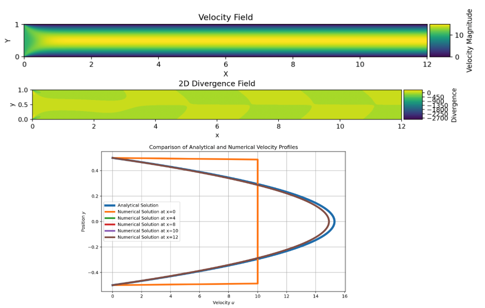

# Results

## 1. Collocated Grid

### 1.1. Channel Flow 

The first test case uses a simple channel flow to evaluate the performance of the collocated grid arrangement. Once the steady state is reached, the velocity and divergence fields are analyzed to assess numerical stability and mass conservation. To validate the solution, the velocity profile at the fully developed region is compared against the analytical Poiseuille solution.

**Figure:** Velocity and divergence fields at steady state, along with velocity profile comparison against Poiseuille flow.

Steady-state velocity and divergence fields for channel flow (collocated grid), with velocity profile comparison to Poiseuille solution at fully developed region.

### 1.2. Velocity Field
- Behavior of the velocity field (u and v components).
- Note any divergence or artifacts from decoupling.

### 1.3. Convergence
- Number of iterations to reach the stopping criterion.
- Plot of residual norm vs iterations.

### 1.4. Comments
- Summary of performance and limitations.
- Notes on pressure-velocity coupling and grid sensitivity.

---

## 2. Staggered Grid

### 2.1. Pressure Field
- Description of the pressure field using staggered grid.
- Comparison with collocated approach.

### 2.2. Velocity Field
- Description of the velocity distribution.
- Improvements or differences compared to collocated grid.

### 2.3. Convergence
- Performance summary: iteration count, residual trends.

### 2.4. Comments
- Interpretation of results.
- Benefits and stability of the staggered arrangement.

---

