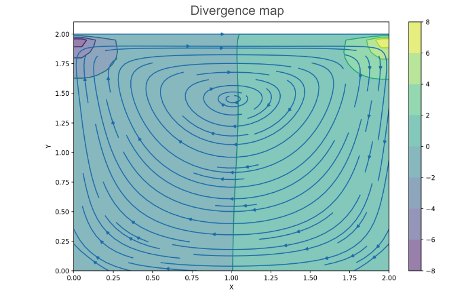
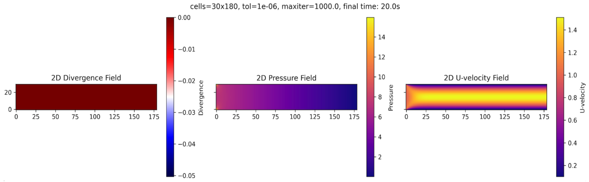
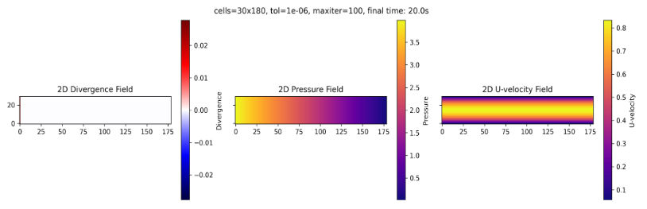

# Solutions

### Lid-Driven Cavity
We begin with this case because it is the one presented in [Lorena Barba’s educational CFD series](https://lorenabarba.com/blog/cfd-python-12-steps-to-navier-stokes/) and widely recognized as a pedagogical introduction to solving the incompressible Navier-Stokes equations. 

The lid-driven cavity is a classical benchmark problem in computational fluid dynamics, it oftenly used to test the accuracy and stability of numerical solvers for incompressible flows, given its simplicity. The domain consists of a square cavity with stationary walls and a top lid moving at constant horizontal velocity. This setup creates a primary circulating vortex in the center of the cavity, making it an excellent case for evaluating velocity-pressure coupling, vorticity transport, and boundary layer resolution.  

  <table>
    <thead>
      <tr>
        <th style="text-align: center;">Boundary</th>
        <th style="text-align: center;">Type</th>
        <th style="text-align: center;">Velocity Condition</th>
        <th style="text-align: center;">Pressure Condition</th>
      </tr>
    </thead>
    <tbody>
      <tr>
        <td style="text-align: center;">Top</td>
        <td style="text-align: center;">Moving wall (non-slip)</td>
        <td style="text-align: center;">u = Ulid, v = 0</td>
        <td style="text-align: center;">Zero-gradient (Neumann)</td>
      </tr>
      <tr>
        <td style="text-align: center;">Bottom</td>
        <td style="text-align: center;">Wall (non-slip)</td>
        <td style="text-align: center;">u = 0, v = 0</td>
        <td style="text-align: center;">Zero-gradient (Neumann)</td>
      </tr>
      <tr>
        <td style="text-align: center;">Left</td>
        <td style="text-align: center;">Wall (non-slip)</td>
        <td style="text-align: center;">u = 0, v = 0</td>
        <td style="text-align: center;">Zero-gradient (Neumann)</td>
      </tr>
      <tr>
        <td style="text-align: center;">Right</td>
        <td style="text-align: center;">Wall (non-slip)</td>
        <td style="text-align: center;">u = 0, v = 0</td>
        <td style="text-align: center;">Zero-gradient (Neumann)</td>
      </tr>
    </tbody>
  </table>

Velocity streamlines and divergence map for the lid-driven cavity flow problem.

The selected boundary conditions are consistent with the classical formulation of the lid-driven cavity problem. **No-slip conditions are applied along all walls**, ensuring zero velocity at the boundaries with the static walls. The top boundary (corresponding to the moving lid) is prescribed with a constant horizontal velocity and zero vertical velocity, which drives the internal circulation. Pressure is left unconstrained, with zero-gradient (Neumann) conditions on all boundaries to maintain consistency with the incompressible formulation.

The velocity streamlines show a **primary vortex flow** along the center of the cavity. Smaller **secondary vortices** forming near the bottom corners. Streamlines clearly show the rotational pattern generated by the lid movement, while the divergence map confirms that the solution is nearly divergence-free throughout the domain. We can also observe how divergence regions are located int he top corners, this is due to the sudden imposed velocity change, given the fact that vertical walls are static but the lid is in movement. 

The velocity streamlines show a well-defined **primary vortex** occupying the central region of the cavity, driven by the motion of the top lid. The divergence map confirms that the solution remains nearly divergence-free across the domain, however **small regions of accumulated divergence are observed near the top corners**, resulting from the abrupt velocity transition between the non slip conditions of the stationary vertical walls and the moving lid.

### Channel Flow

In this section, we explore two alternative boundary condition configurations used to model steady, incompressible flow in a 2D channel. Although the geometry remains the same, the outlet treatment differs and leads to slightly different numerical behavior.

---

### Configuration 1: Fixed Inlet Velocity

This setup imposes a uniform velocity at the inlet and fixes the pressure at the outlet to anchor the pressure field. This configuration mimics an open channel where the flow is driven by a prescribed inlet velocity and develops downstream under a pressure gradient.

<!-- 
|   Boundary   |   Type   |      Velocity Condition      |    Pressure Condition     |
|:------------:|:--------:|:----------------------------:|:-------------------------:|
|    Inlet     |  Inflow  | Uniform inflow (Dirichlet)   | Zero-gradient (Neumann)   |
|   Outlet     | Outflow  | Zero-gradient (Neumann)      | Fixed pressure (Dirichlet)|
| Top/Bottom   |  Wall    | No-slip (u = 0, Dirichlet)   | Zero-gradient (Neumann)   | -->

  <table>
    <thead>
      <tr>
        <th style="text-align: center;">Boundary</th>
        <th style="text-align: center;">Type</th>
        <th style="text-align: center;">Velocity Condition</th>
        <th style="text-align: center;">Pressure Condition</th>
      </tr>
    </thead>
    <tbody>
      <tr>
        <td style="text-align: center;">Inlet</td>
        <td style="text-align: center;">Inflow</td>
        <td style="text-align: center;">Uniform inflow (Dirichlet)</td>
        <td style="text-align: center;">Zero-gradient (Neumann)</td>
      </tr>
      <tr>
        <td style="text-align: center;">Outlet</td>
        <td style="text-align: center;">Outflow</td>
        <td style="text-align: center;">Zero-gradient (Neumann)</td>
        <td style="text-align: center;">Fixed pressure (Dirichlet)</td>
      </tr>
      <tr>
        <td style="text-align: center;">Top/Bottom</td>
        <td style="text-align: center;">Wall</td>
        <td style="text-align: center;">No-slip (u = 0, Dirichlet)</td>
        <td style="text-align: center;">Zero-gradient (Neumann)</td>
      </tr>
    </tbody>
  </table>

Divergence map, pressure field and velocity magnitude for configuration 1 of the channel flow problem. 

The velocity field shows the expected behavior induced by the no-slip condition at the walls. A strong vertical gradient in the horizontal velocity component develops near the solid boundaries, forming a parabolic-like profile across the height of the channel. Additionally, we can observe how the flow gradually develops along the streamwise direction, transitioning from the uniform inlet condition to the characteristic profile of a fully developed channel flow. The following figure provides a closer look at this velocity profile by comparing simulated profiles at different streamwise locations with the analytical Poiseuille solution. Notice that the orange curve represents a uniform velocity, corresponding to the inlet condition, before the flow begins to develop.

Horizontal velocity profiles at multiple cross-sections along the channel, compared to the analytical Poiseuille solution.

The pressure field remains nearly constant in the vertical direction and exhibits a steady decrease along the length of the channel. This behavior reflects the well known **negative pressure gradient** that drives the flow in a pressure-driven channel.

Although the simulation reaches a steady state, a small region of **negative divergence** is visible near the inlet. This localized mass imbalance results from the interaction between the imposed inlet velocity and the developed pressure field. In the next configuration, I tried to **eliminate this divergence** by using boundary conditions that will simulate a fully developed inflow, as if that was not the actual entrance of the pipe. 

### Configuration 2: Fixed Inlet/Outlet Pressure

In this setup, pressure is fixed at both the inlet and the outlet. Rather than prescribing a velocity profile, the flow develops naturally in response to the **imposed pressure difference** across the domain. This configuration is commonly used to simulate fully developed channel flow driven by a pressure gradient. Notice how the velocity profile is already developed at the entrance, eliminating the entrance region observed in the previous setup.

  <table>
    <thead>
      <tr>
        <th style="text-align: center;">Boundary</th>
        <th style="text-align: center;">Type</th>
        <th style="text-align: center;">Velocity Condition</th>
        <th style="text-align: center;">Pressure Condition</th>
      </tr>
    </thead>
    <tbody>
      <tr>
        <td style="text-align: center;">Inlet</td>
        <td style="text-align: center;">Inflow</td>
        <td style="text-align: center;">Zero-gradient (Neumann)</td>
        <td style="text-align: center;">p = 4 (Dirichlet)</td>
      </tr>
      <tr>
        <td style="text-align: center;">Outlet</td>
        <td style="text-align: center;">Outflow</td>
        <td style="text-align: center;">Zero-gradient (Neumann)</td>
        <td style="text-align: center;">p = 0 (Dirichlet)</td>
      </tr>
      <tr>
        <td style="text-align: center;">Top/Bottom</td>
        <td style="text-align: center;">Wall</td>
        <td style="text-align: center;">No-slip (u = 0, Dirichlet)</td>
        <td style="text-align: center;">Zero-gradient (Neumann)</td>
      </tr>
    </tbody>
  </table>

Velocity magnitude, pressure field, and divergence map for Configuration 2 (pressure-driven flow).

The divergence field is similar to the previous case, with a **small region of nonzero divergence** near the inlet. The magnitude of the divergence is about half for this BC setup, which suggests that the pressure-driven boundary conditions could help minimize artificial divergence introduced by mismatched inflow profiles.

With **fixed pressure** at both the inlet and the outlet, and zero-gradient conditions applied to velocity, the flow adjusts naturally to the imposed pressure difference. The pressure field exhibits a **uniform gradient along the length of the channel**, as expected for a fully developed, pressure-driven flow.

Finally, the velocity field is **fully developed from the very entrance** of the domain, showing a stable parabolic profile throughout the channel. Unlike Configuration 1, there is no entrance region where the velocity evolves.  

### Wind Turbine in Open Flow

This simulation models an open-domain flow interacting with an obstacle resembling a wind turbine. The case is intended to illustrate how the presence of a bluff body modifies the pressure and velocity field and how a well-posed boundary condition setup maintains mass conservation and solution stability.

PONER AQUI LAS 3 FIGURAS PERO ANTES.. 
1) CHOPEARLAS POR ARRIBA.
2) Cambiar el titulo, que ponga lo que es, y quitar lo otro. 
3) Pegarlas intercaladamente, entre parrafos. 

The top figure shows the velocity field. A uniform inflow condition is imposed at the left boundary. As the flow approaches the turbine, the velocity decreases just upstream of the rotor — a stagnation region forms, reducing the local velocity magnitude. Around the outer edges of the turbine, the flow accelerates, demonstrating local conservation of momentum as the fluid is forced to move around the obstacle. Downstream of the turbine, a wake forms: a low-velocity region that gradually recovers as momentum is diffused back into the flow.

The middle figure shows the pressure distribution. The pressure remains near zero across most of the domain, except in the immediate vicinity of the turbine. A region of elevated pressure is visible in front of the obstacle, while a region of negative pressure (pressure drop) develops just behind it. This is consistent with the classic pressure signature of bluff-body flow.

The bottom figure shows the divergence field. The solution is nearly divergence-free throughout the domain, confirming the stability and consistency of the solver. The color scale reveals values on the order of \(10^{-5}\), indicating that mass conservation is satisfied up to numerical precision.

#### Computational Parameters
INCLUIR parrafo aki. 

<table>
  <thead>
    <tr>
      <th style="text-align: center;">Parameter</th>
      <th style="text-align: center;">Value</th>
    </tr>
  </thead>
  <tbody>
    <tr>
      <td style="text-align: center;">Domain Size</td>
      <td style="text-align: center;">(Lx, Ly) = (6, 2)</td>
    </tr>
    <tr>
      <td style="text-align: center;">Grid Resolution</td>
      <td style="text-align: center;">nx = 300, ny = 100</td>
    </tr>
    <tr>
      <td style="text-align: center;">Reynolds Number</td>
      <td style="text-align: center;">Re = 100</td>
    </tr>
    <tr>
      <td style="text-align: center;">Time Stepping</td>
      <td style="text-align: center;">Δt = 0.001, steady-state solution</td>
    </tr>
    <tr>
      <td style="text-align: center;">Solver</td>
      <td style="text-align: center;">Projection method with Jacobi Poisson solver</td>
    </tr>
  </tbody>
</table>

---