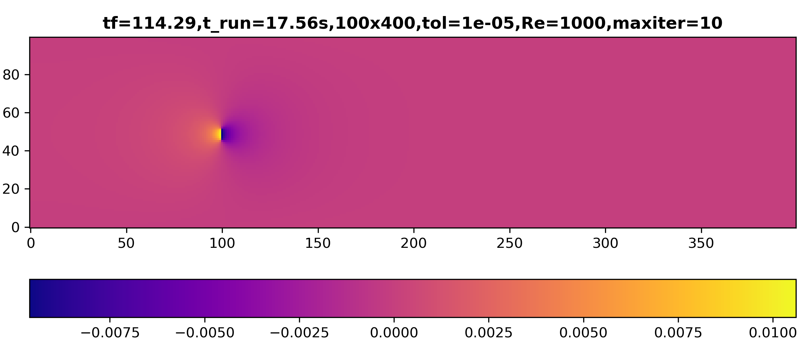
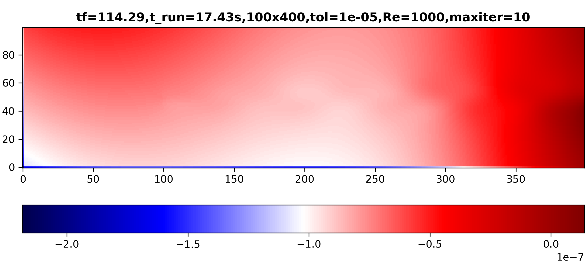

# Solutions

### Lid-Driven Cavity
We begin with this case because it is the one presented in [Lorena Barba’s educational CFD series](https://lorenabarba.com/blog/cfd-python-12-steps-to-navier-stokes/) and widely recognized as a pedagogical introduction to solving the incompressible Navier-Stokes equations. 

The lid-driven cavity is a classical benchmark problem in computational fluid dynamics, it oftenly used to test the accuracy and stability of numerical solvers for incompressible flows, given its simplicity. The domain consists of a square cavity with stationary walls and a top lid moving at constant horizontal velocity. This setup creates a primary circulating vortex in the center of the cavity, making it an excellent case for evaluating velocity-pressure coupling, vorticity transport, and boundary layer resolution.  

  <table>
    <thead>
      <tr>
        <th style="text-align: center;">Boundary</th>
        <th style="text-align: center;">Type</th>
        <th style="text-align: center;">Velocity Condition</th>
        <th style="text-align: center;">Pressure Condition</th>
      </tr>
    </thead>
    <tbody>
      <tr>
        <td style="text-align: center;">Top</td>
        <td style="text-align: center;">Moving wall (non-slip)</td>
        <td style="text-align: center;">u = Ulid, v = 0</td>
        <td style="text-align: center;">Zero-gradient (Neumann)</td>
      </tr>
      <tr>
        <td style="text-align: center;">Bottom</td>
        <td style="text-align: center;">Wall (non-slip)</td>
        <td style="text-align: center;">u = 0, v = 0</td>
        <td style="text-align: center;">Zero-gradient (Neumann)</td>
      </tr>
      <tr>
        <td style="text-align: center;">Left</td>
        <td style="text-align: center;">Wall (non-slip)</td>
        <td style="text-align: center;">u = 0, v = 0</td>
        <td style="text-align: center;">Zero-gradient (Neumann)</td>
      </tr>
      <tr>
        <td style="text-align: center;">Right</td>
        <td style="text-align: center;">Wall (non-slip)</td>
        <td style="text-align: center;">u = 0, v = 0</td>
        <td style="text-align: center;">Zero-gradient (Neumann)</td>
      </tr>
    </tbody>
  </table>

The selected boundary conditions are consistent with the classical formulation of the lid-driven cavity problem. **No-slip conditions are applied along all walls**, ensuring zero velocity at the boundaries with the static walls. The top boundary (corresponding to the moving lid) is prescribed with a constant horizontal velocity and zero vertical velocity, which drives the internal circulation. Pressure is left unconstrained, with zero-gradient (Neumann) conditions on all boundaries to maintain consistency with the incompressible formulation.

Velocity streamlines and divergence map for the lid-driven cavity flow problem.

The velocity streamlines show a well-defined **primary vortex** occupying the central region of the cavity, driven by the motion of the top lid. The divergence map confirms that the solution remains nearly divergence-free across the domain, however **small regions of accumulated divergence are observed near the top corners**, resulting from the radical velocity transition between the non slip conditions of the stationary vertical walls and the moving lid.

### Channel Flow

In this section, we explore two alternative boundary condition configurations used to model steady, incompressible flow in a 2D channel. Although the geometry remains the same, the outlet treatment differs and leads to slightly different numerical behavior.

---

### Configuration 1: Fixed Inlet Velocity

This setup imposes a uniform velocity at the inlet and fixes the pressure at the outlet to anchor the pressure field. This configuration mimics an open channel where the flow is driven by a prescribed inlet velocity and develops downstream under a pressure gradient.

<!-- 
|   Boundary   |   Type   |      Velocity Condition      |    Pressure Condition     |
|:------------:|:--------:|:----------------------------:|:-------------------------:|
|    Inlet     |  Inflow  | Uniform inflow (Dirichlet)   | Zero-gradient (Neumann)   |
|   Outlet     | Outflow  | Zero-gradient (Neumann)      | Fixed pressure (Dirichlet)|
| Top/Bottom   |  Wall    | No-slip (u = 0, Dirichlet)   | Zero-gradient (Neumann)   | -->

  <table>
    <thead>
      <tr>
        <th style="text-align: center;">Boundary</th>
        <th style="text-align: center;">Type</th>
        <th style="text-align: center;">Velocity Condition</th>
        <th style="text-align: center;">Pressure Condition</th>
      </tr>
    </thead>
    <tbody>
      <tr>
        <td style="text-align: center;">Inlet</td>
        <td style="text-align: center;">Inflow</td>
        <td style="text-align: center;">Uniform inflow (Dirichlet)</td>
        <td style="text-align: center;">Zero-gradient (Neumann)</td>
      </tr>
      <tr>
        <td style="text-align: center;">Outlet</td>
        <td style="text-align: center;">Outflow</td>
        <td style="text-align: center;">Zero-gradient (Neumann)</td>
        <td style="text-align: center;">Fixed pressure (Dirichlet)</td>
      </tr>
      <tr>
        <td style="text-align: center;">Top/Bottom</td>
        <td style="text-align: center;">Wall</td>
        <td style="text-align: center;">No-slip (u = 0, Dirichlet)</td>
        <td style="text-align: center;">Zero-gradient (Neumann)</td>
      </tr>
    </tbody>
  </table>

Divergence map, pressure field and velocity magnitude for configuration 1 of the channel flow problem. 

The velocity field shows the expected behavior induced by the no-slip condition at the walls. A strong vertical gradient in the horizontal velocity component develops near the solid boundaries, forming a parabolic-like profile across the height of the channel. Additionally, we can observe how the flow gradually develops along the streamwise direction, transitioning from the uniform inlet condition to the characteristic profile of a fully developed channel flow. The following figure provides a closer look at this velocity profile by comparing simulated profiles at different streamwise locations with the analytical Poiseuille solution. Notice that the orange curve represents a uniform velocity, corresponding to the inlet condition, before the flow begins to develop.

Horizontal velocity profiles at multiple cross-sections along the channel, compared to the analytical Poiseuille solution.

The pressure field remains nearly constant in the vertical direction and exhibits a steady decrease along the length of the channel. This behavior reflects the well known **negative pressure gradient** that drives the flow in a pressure-driven channel.

Although the simulation reaches a steady state, a small region of **negative divergence** is visible near the inlet. This localized mass imbalance results from the interaction between the imposed inlet velocity and the developed pressure field. In the next configuration, I tried to **eliminate this divergence** by using boundary conditions that will simulate a fully developed inflow, as if that was not the actual entrance of the pipe. 

### Configuration 2: Fixed Inlet/Outlet Pressure

In this setup, pressure is fixed at both the inlet and the outlet. Rather than prescribing a velocity profile, the flow develops naturally in response to the **imposed pressure difference** across the domain. This configuration is commonly used to simulate fully developed channel flow driven by a pressure gradient. Notice how the velocity profile is already developed at the entrance, eliminating the entrance region observed in the previous setup.

  <table>
    <thead>
      <tr>
        <th style="text-align: center;">Boundary</th>
        <th style="text-align: center;">Type</th>
        <th style="text-align: center;">Velocity Condition</th>
        <th style="text-align: center;">Pressure Condition</th>
      </tr>
    </thead>
    <tbody>
      <tr>
        <td style="text-align: center;">Inlet</td>
        <td style="text-align: center;">Inflow</td>
        <td style="text-align: center;">Zero-gradient (Neumann)</td>
        <td style="text-align: center;">p = 4 (Dirichlet)</td>
      </tr>
      <tr>
        <td style="text-align: center;">Outlet</td>
        <td style="text-align: center;">Outflow</td>
        <td style="text-align: center;">Zero-gradient (Neumann)</td>
        <td style="text-align: center;">p = 0 (Dirichlet)</td>
      </tr>
      <tr>
        <td style="text-align: center;">Top/Bottom</td>
        <td style="text-align: center;">Wall</td>
        <td style="text-align: center;">No-slip (u = 0, Dirichlet)</td>
        <td style="text-align: center;">Zero-gradient (Neumann)</td>
      </tr>
    </tbody>
  </table>

Velocity magnitude, pressure field, and divergence map for Configuration 2 (pressure-driven flow).

The divergence field is similar to the previous case, with a **small region of nonzero divergence** near the inlet. The magnitude of the divergence is about half for this BC setup, which suggests that the pressure-driven boundary conditions could help minimize artificial divergence introduced by mismatched inflow profiles.

With **fixed pressure** at both the inlet and the outlet, and zero-gradient conditions applied to velocity, the flow adjusts naturally to the imposed pressure difference. The pressure field exhibits a **uniform gradient along the length of the channel**, as expected for a fully developed, pressure-driven flow.

Finally, the velocity field is **fully developed from the very entrance** of the domain, showing a stable parabolic profile throughout the channel. Unlike Configuration 1, there is no entrance region where the velocity evolves.  

### Wind Turbine in Open Flow

In this case, I simulated an open-channel flow interacting with a **wind turbine** placed at the center of the domain. The objective is to analyze how the presence of the turbine alters the surrounding velocity, pressure, and divergence fields, and to capture the formation and development of a wake. This setup is representative of utility-scale wind turbine siting, where the inflow is nearly uniform and the behavior of the downstream wake is of particular interest.

The effect of the turbine is modeled using the **actuator disk theory**, a simplified aerodynamic model that treats the turbine as a **porous disk imposing a resistive force on the flow**. This approach captures the key features of wake formation in a really simplified manner, without resolving individual blades. For a comprehensive understanding of actuator disk theory, see [Burton et al. 2011](#ref2).

The axial induction force is introduced as a **body force term** in the momentum equation, applied over the region representing the rotor. The force acts in the streamwise (x) direction and takes the following form:

\[
f_x(x, y) = -\frac{1}{2} C_T \, \frac{U_{\infty}^2}{\Delta x} \, \chi(x, y)
\]

Where:  
- \( f_x(x, y) \) is the body force **per unit mass** in the x-direction  
- \( C_T \) is the thrust coefficient  
- \( U_{\infty} \) is the inlet velocity  
- \( \Delta x \) is the grid spacing (cell width) in the x-direction  
- \( \chi(x, y) \) is a boolean function that defines what cells are part of a turbine  

This formulation assumes that the **actuator force is distributed uniformly over the rotor region**, and the grid spacing \( \Delta x \) is used to convert the area-based \( C_T \) into a per-volume term. Dividing by \( \rho \) then yields the specific force per unit mass, consistent with how forces are applied in the discretized velocity equation.

This formulation results in a distinctive pressure profile along the centerline of the domain, which can be visualized in the figure below. The actuator disk imposes a resistive force that causes a sharp **pressure jump across the rotor**, with a build-up upstream and a drop downstream. The pressure then gradually returns to the far-field inlet level, which is set to zero. This distribution is characteristic of actuator disk theory and reflects the exchange of momentum between the flow and the turbine.

Pressure distribution along the centerline of the domain. The pressure increases upstream of the rotor, drops sharply across it, and gradually recovers downstream.

The **wake recovery effect** observed downstream of the turbine is captured by the presence of the **diffusion term** in the momentum equation. As discussed in the [Governing Equations](#governing_equations) chapter, the advection-diffusion formulation inherently includes both the transport of momentum and its **redistribution through viscous effects**.

This case also serves to demonstrate **how easily body forces can be implemented in numerical solvers** and how their influence affects the rest of the domain. The results show how **strong the coupling between the pressure and velocity fields** is, and demonstrate the **action of viscous diffusion**.

Horizontal velocity field (u-component) for flow through a turbine in open-flow conditions.

The velocity field shown above illustrates a uniform inflow imposed at the left boundary. As the flow approaches the turbine, it slows down just upstream of the rotor, forming a stagnation region where the velocity magnitude decreases. Around the outer edges of the turbine, the flow accelerates, demonstrating local conservation of momentum as the fluid redirects around the obstacle. Downstream, a wake develops—a low-velocity region that gradually recovers as momentum diffuses back into the flow.

Pressure field for flow through a turbine in open-flow conditions.

The pressure field displayed above remains near zero across most of the domain, except in the immediate vicinity of the turbine. A region of elevated pressure forms in front of the obstacle, while a region of reduced pressure develops just behind it. This distribution is consistent with the classic pressure signature observed in bluff-body flow.

Divergence map for flow through a turbine in open-flow conditions. The solution remains nearly divergence-free throughout the domain.

The divergence field shown above confirms that the solution is nearly divergence-free across the domain, validating the stability and consistency of the solver. The color scale indicates values on the order of \(10^{-5}\), demonstrating that mass conservation is maintained up to numerical precision.

#### Computational Parameters
INCLUIR parrafo aki. 

<table>
  <thead>
    <tr>
      <th style="text-align: center;">Parameter</th>
      <th style="text-align: center;">Value</th>
    </tr>
  </thead>
  <tbody>
    <tr>
      <td style="text-align: center;">Domain Size</td>
      <td style="text-align: center;">(Lx, Ly) = (6, 2)</td>
    </tr>
    <tr>
      <td style="text-align: center;">Grid Resolution</td>
      <td style="text-align: center;">nx = 300, ny = 100</td>
    </tr>
    <tr>
      <td style="text-align: center;">Reynolds Number</td>
      <td style="text-align: center;">Re = 100</td>
    </tr>
    <tr>
      <td style="text-align: center;">Time Stepping</td>
      <td style="text-align: center;">Δt = 0.001, steady-state solution</td>
    </tr>
    <tr>
      <td style="text-align: center;">Solver</td>
      <td style="text-align: center;">Projection method with Jacobi Poisson solver</td>
    </tr>
  </tbody>
</table>

---
<!-- 
## Embedd video test 

### MP4
<video width="640" height="360" controls>
  <!-- <source src="images/video.webm"type="video/webm"> -->
  <!-- <source src="../images/movie.mp4" type="video/mp4">
  Your browser does not support the video tag.
</video>

### GIF
The GIF lost quality.. but that is due to the way I converted it. 
 --> -->
